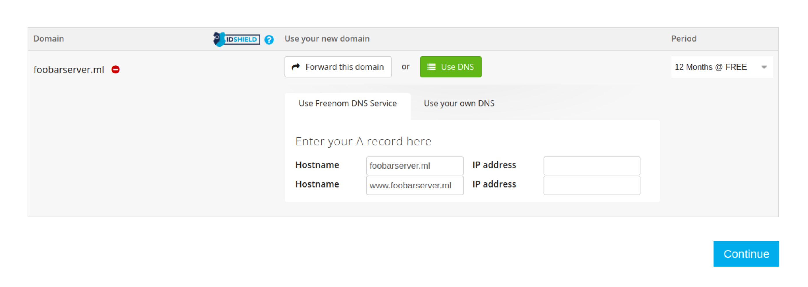

# Vmess + H2 + TLS easy install
Easy Setup Of Vmess + H2 + TLS with The Latest Xray

## What do you need?
0. For sure a VPS; a cheap one with minimum 384 MB of memory, **with ports 80 and 443 open** (approximate price: > 1$/month. advice: get an EU server).
1. Debian or Ubuntu with a root account.
2. A domain. Go to register one for free on Freenom: https://www.freenom.com, or buy one from any sources you know.
* Select .ml for certain countries that censor blocks the domains based on suffixes.
3. Add the Public Ip Address of your server to your domain while registering on Freenom. You can also add them later on in the DNS records section of domain management.
* For Freenom, add your Public Ip while registering by filling in both IP address fields.


## Setup your proxy server
0. Login to your server as root user by ssh (or VNC, telnet, etc.).
1. You may first need to install `curl` (`apt install curl`)
2. Open a Terminal window and run the following:
```
bash <(curl -s https://raw.githubusercontent.com/free-the-internet/Vmess-h2-tls-easy-install/main/xv2ray_install.sh)
```
## Adding clients
There is a script. It creates a new user, restarts the service and prints base64 and info of the newly generated client.

Download it to your favorite directory using the following command:
```
curl -O https://raw.githubusercontent.com/free-the-internet/Vmess-h2-tls-easy-install/main/add_user.sh
```
Change directory to the choosen directory and and run it by `bash add_user.sh`
